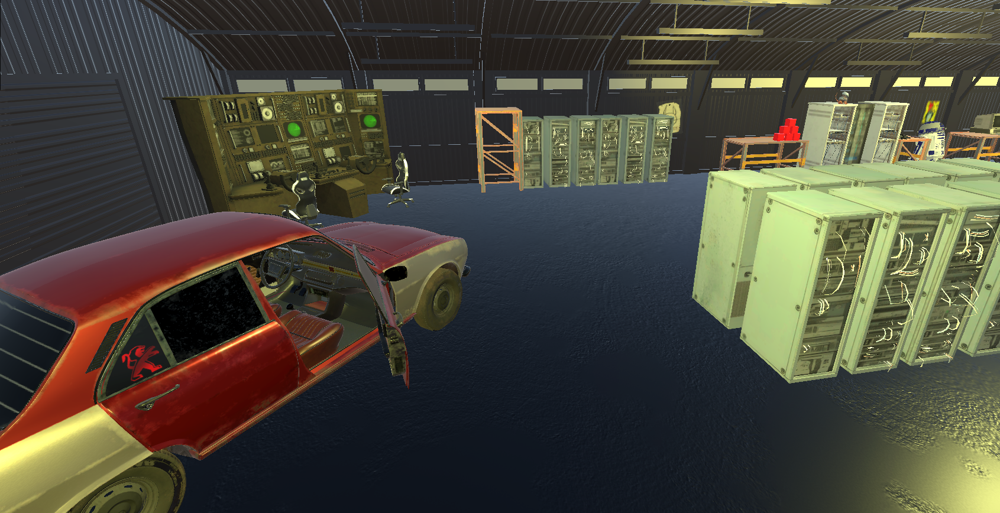
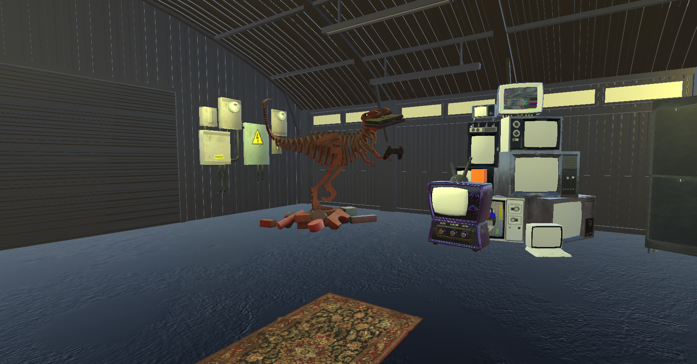

# IVO-VR - Proyecto de Realidad Virtual

## Descripción del Proyecto

IVO-VR es un proyecto de realidad virtual desarrollado en Unity que simula un ambiente de galpón industrial/tecnológico. El proyecto está diseñado para funcionar con dispositivos Meta Quest (anteriormente Oculus) y proporciona una experiencia inmersiva donde los usuarios pueden interactuar con diversos objetos en un entorno virtual.

## Características del Proyecto

### 🎮 **Tecnología Base**
- **Motor de Juego**: Unity 2022.3.42f1 LTS
- **SDK de VR**: Meta XR All-in-One SDK v77
- **Plataforma Objetivo**: Meta Quest (Quest 1, Quest 2, Quest 3, Quest Pro)
- **XR Framework**: Meta XR SDK integrado

### 🏭 **Entorno Virtual**
- **Escena Principal**: "Galpon VR" - Un galpón industrial virtual
- **Ambiente**: Espacio de trabajo tecnológico con múltiples objetos interactivos
- **Iluminación**: Sistema de iluminación optimizado para VR

### 📦 **Assets y Recursos**

#### Modelos 3D Incluidos:
- **Tecnología**:
  - Computadoras vintage y modernas
  - Servidores y racks de red
  - Teléfonos celulares (iPhone, Motorola, teléfonos vintage)
  - Consolas de videojuegos (PlayStation, Nintendo, Xbox)
  - Televisores y monitores CRT

- **Mobiliario**:
  - Mesas de trabajo y reunión
  - Sillas gaming y de oficina
  - Estanterías y pallets
  - Escritorios de computadora

- **Objetos Decorativos**:
  - Figuras Funko Pop (Sonic, Wall-E, Pokémon)
  - Posters y decoración
  - Juguetes y coleccionables
  - Cajas de cartón y contenedores

- **Vehículos**:
  - Peugeot 504

#### Materiales:
- Sistema de materiales con colores base:
  - Azul (blue.mat)
  - Verde (green.mat, green 1.mat)
  - Naranja (orange.mat)
  - Rojo (red.mat)
  - Violeta (violet.mat)

### 🕹️ **Sistema de Interacción**

#### Scripts Desarrollados:
- **GrabbableInputManager**: Gestor de entrada para objetos que se pueden agarrar
  - Hereda de MonoBehaviour
  - Sistema base para interacciones de agarre en VR

### 🎯 **Funcionalidades Implementadas**

1. **Renderizado VR**: 
   - Soporte completo para headsets Meta Quest
   - Optimizado para renderizado estéreo
   - Sistema de seguimiento de cabeza y controladores

2. **Sistema de Materiales**:
   - Shaders optimizados para VR (TextMeshPro)
   - Materiales PBR para objetos 3D
   - Sistema de iluminación dinámico

3. **Gestión de Assets**:
   - Estructura organizada de recursos
   - Metadatos optimizados
   - Sistema de streaming de assets

### 📁 **Estructura del Proyecto**

```
IVO-VR/
├── Assets/
│   ├── Scenes/
│   │   └── Galpon VR/          # Escena principal del galpón
│   ├── Scripts/
│   │   └── GrabbableInputmanager.cs  # Sistema de interacción
│   ├── Materiales/             # Materiales del proyecto
│   ├── Recursos/               # Modelos 3D y assets
│   ├── MetaXR/                 # SDK de Meta para VR
│   ├── Oculus/                 # Componentes Oculus legacy
│   ├── XR/                     # Componentes XR de Unity
│   └── TextMesh Pro/           # Sistema de texto para VR
├── ProjectSettings/            # Configuraciones del proyecto
├── Packages/                   # Paquetes y dependencias
└── screens/                    # Capturas de pantalla
    ├── coche.png
    └── dino.png
```

## 🔧 **Configuración y Desarrollo**

### Dependencias Principales:
- `com.meta.xr.sdk.all`: Meta XR All-in-One SDK v77
- `com.unity.test-framework`: Framework de testing

### Build Settings:
- Target Platform: Android (Meta Quest)
- XR Settings: Meta XR All-in-One SDK configurado
- Graphics API: Vulkan/OpenGL ES

## 🚀 **Estado Actual del Desarrollo**

### ✅ Completado:
- ✅ Configuración base del proyecto VR
- ✅ Integración con Meta XR All-in-One SDK v77
- ✅ Escena principal del galpón
- ✅ Importación y organización de assets 3D
- ✅ Sistema básico de materiales
- ✅ Estructura base para interacciones
- ✅ Configuración de iluminación

### 🔄 En Desarrollo:
- 🔄 Optimización de rendimiento para VR

### 📋 Próximos Pasos:

- [ ] Implementar audio espacial


## 📸 **Capturas de Pantalla**

### Vista del Galpón VR

*Vista del entorno del galpón con modelo de vehículo*

### Ambiente con Objetos Interactivos

*Detalle del ambiente con objetos decorativos y coleccionables*

## 🎮 **Cómo Ejecutar**

1. Abrir el proyecto en Unity 2022.3.42f1 o superior
2. Asegurar que el asset All-in-One SDK v77 esté correctamente configurado
3. Conectar dispositivo Meta Quest via Oculus Link o Air Link
4. Hacer build para Android con configuración XR habilitada
5. Instalar en el dispositivo Quest

## 📄 **Licencia**

Proyecto en desarrollo para fines educativos y de demostración.

---

**Desarrollado con Unity y Meta XR All-in-One SDK v77**